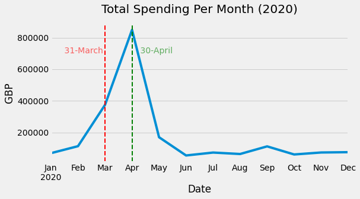

# Home Office procurement card spend over £500: 2020

There was a [tweet on 26th March 2020](https://twitter.com/lloydhardy/status/1375363511962980352?s=20) with a screenshot of some Home Office spending. I was curious about how easy it is to harvest, clean and summarise the spending data. I also wanted to check the reported information was correct.

The article originally appeared in Byline Times as '[Home Office Fails to Explain Strange Expenses](https://bylinetimes.com/2021/03/24/home-office-fails-to-explain-strange-expenses/)'. The Home Office did respond 26-Mar-2021 to say that purchases were made for PPE and clothing for asylum seekers.

## Source Data

* Home Office data [scraped from here](https://www.gov.uk/government/publications/home-office-procurement-card-spend-over-500-2020) on 26-Mar-2021
* Data are split across twelve CSV files
* Data covers the 2020 calendar year
* Data published 19-Mar-2021

## Report

Spending 2020 at the end of the [Jupyter notebook](HomeOffice.ipynb) contains:

* Total spend for year: £2,097,376.09
* March and April 2020 at the first lockdown have spike increase in spending and account for 58% of the 2020 spend
* Chart and table of spending per month
* Table of top 20 supplier spend for 2020
* Table of top 20 spend from 01-Mar-2020 to 30-Apr-2020

## Cleaned Data Files

The `Supplier` column had to be processed so that the data could be aggregated as supplier names aren't always consistent. [Levenshtein distance](https://en.wikipedia.org/wiki/Levenshtein_distance) was used for fuzzy matching supplier names.

[cleaned_agg_spend.csv](cleaned_agg_spend.csv) contains data aggregated by supplier for 2020. Columns:

* supplier_fuzzy - the fuzzy match string used to link suppliers
* total_spend_supplier - total spend with supplier over year
* percent_share_spend - percentage of total spend with supplier
* number_purchases - number of purchases made with supplier
* first_purchase - date first purchase made from supplier (yyyy-mm-dd)
* last_purchase - date last purchase made from supplier (yyyy-mm-dd)

[cleaned_spend.csv](cleaned_spend.csv) contains all rows from merging the original twelve CSV files. Columns:

* Date
* Amount
* Supplier
* supplier_clean - some preprocessing on `Supplier` names to help with the fuzzy matching
* supplier_fuzzy - the fuzzy match string used to link suppliers
